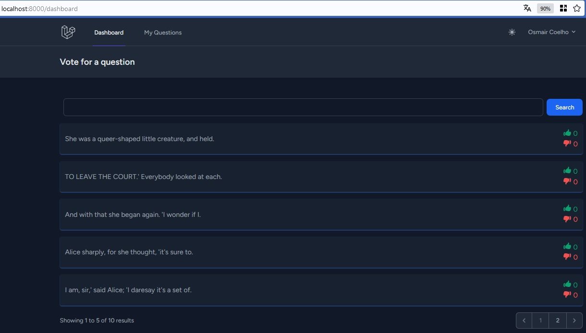
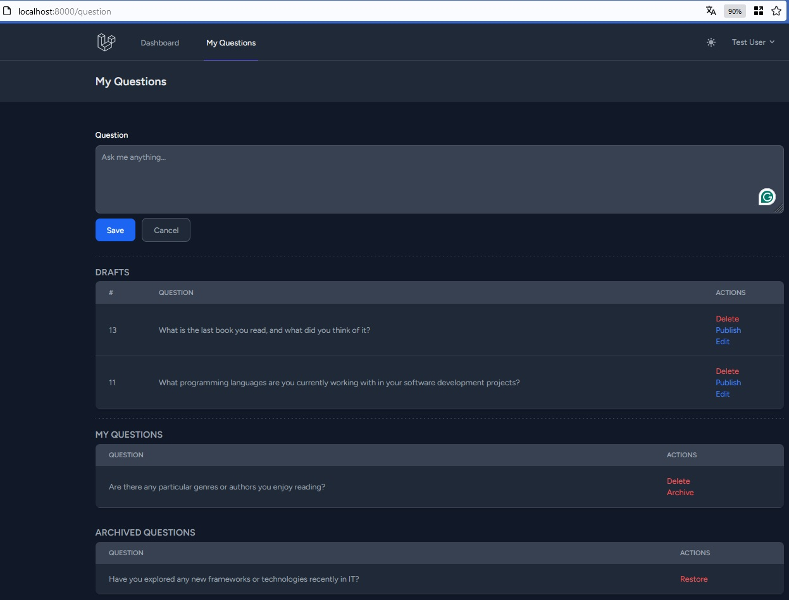
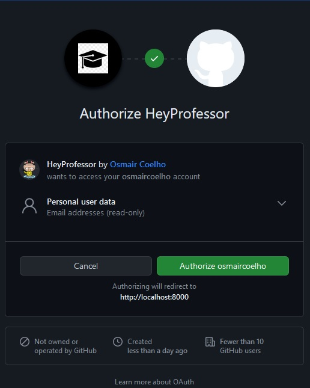

# Hey Professor! 🎓

## Project Description

Hey Professor! is a software project dedicated to creating a list of questions, allowing users to vote for the best questions. The system includes the creation of a questions database, a voting system, a web interface for viewing and voting, as well as features for adding, reviewing, and editing questions by users. It also includes a mechanism to mark answers as responded, moving questions to an archived list.

## Key Features

- 📋 Creation of a questions database.
- 🗳️ Voting system for the best questions.
- 🌐 Web interface for access and voting.
- ➕ Addition of new questions by users.
- ✏️ Review and editing of questions before publication or voting.
- ✔️ Marking of answers as responded, moving questions to the archived list.
- 🔒 Security features to ensure access only to authorized users.
- 🌙 Dark Mode feature.

## Authentication

The project implements authentication via GitHub, ensuring security in access to information and functionalities of the questions list.

## Checking Similar Questions

To avoid duplicates, the system checks the possibility of questions with similar meaning in the database using OpenAI.

## Unit Testing

Unit tests are a fundamental part of development. Hey Professor! uses the Pest testing framework to ensure the robustness of the code. Comprehensive tests have been conducted to ensure the proper functioning of each component of the system.

## Hosting

The application is hosted on the domain [https://hey-professor.000webhost.com](https://hey-professor.000webhost.com).

## Images

### Vote for a Question

### My Questions

### OAuth Github

## Test Credentials

For testing purposes, you can use the following credentials:

- **Username:** test@example.com <button onclick="copyToClipboard('username')">Copy to Clipboard</button>
- **Password:** password <button onclick="copyToClipboard('password')">Copy to Clipboard</button>

This project is part of my studies and will be used to enhance my personal portfolio.
